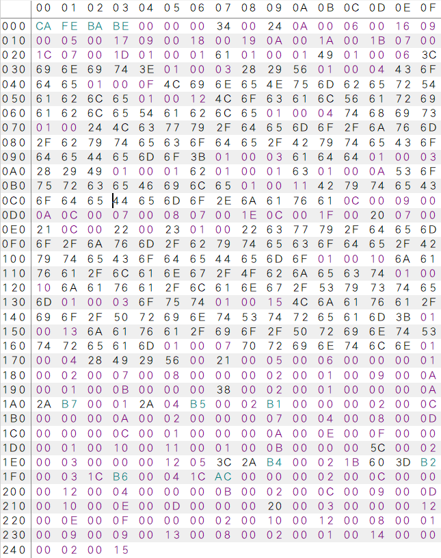
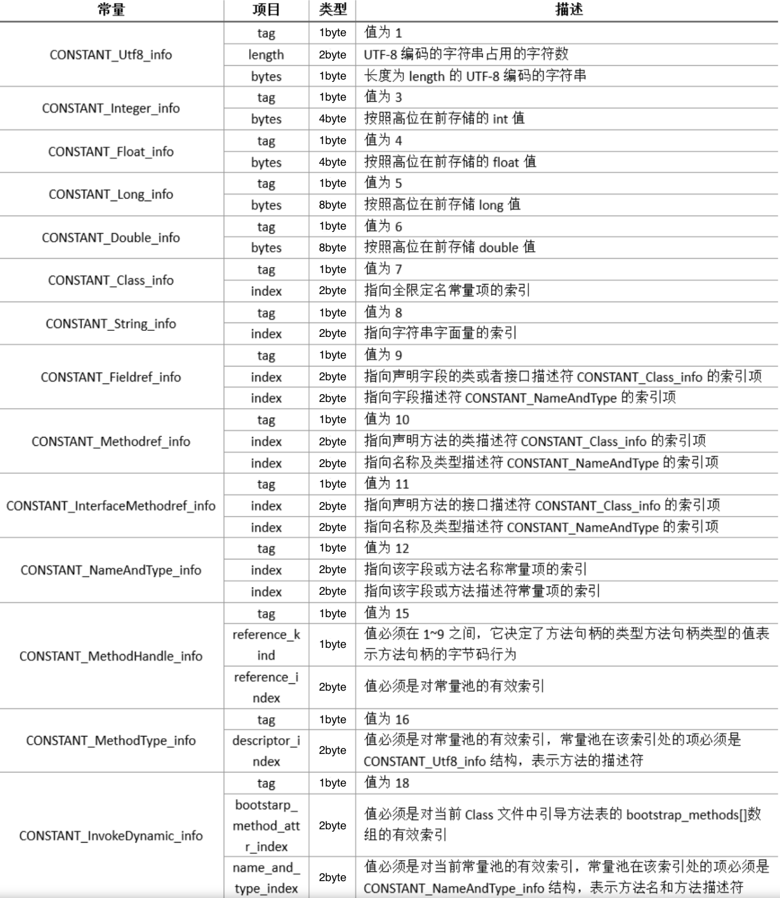

# Java 字节码技术

将一个.java 文件编译成 .class文件后就能得到一个字节码文件，比如源码如下：

```java 
package cwy.demo.jvm.bytecode;

public class ByteCodeDemo {
    private int a = 1;

    public int add(){
        int b = 2;
        int c = a + b;
        System.out.println(c);
        return c;
    }
}
```

编译后的字节码如下：



字节码按字节进行分割，一共分为10个部分，

1. 魔数
2. 版本号
3. 常量池
4. 访问标志
5. 当前类索引
6. 父类索引
7. 接口索引
8. 字段表
9. 方法表
10. 附加属性

## 1. 魔数和版本号

魔数是.class文件的前四个字节，内容为 'cafe babe' 译为 “咖啡宝贝”。JVM虚拟机在加载字节码时会根据前4个字节来判断一个.class文件是不是符合规则。

版本号是字节码的魔数后面的4个字节，分为两段，前两个字节为 **次版本号** 后两个字节为 **主版本号** 上文中的 00 00 00 34 对应的主版本号为 52 次版本号为 0，编译该文件的Java版本为 1.8.0。

## 2. 常量池

常量池分为两段，前一段是常量池数量，用2个字节表示，后一段是常量池的内容，由cp_info结构组成的集合。一个cp_info对应一个常量，一共有14种类型，如下图所示。




上面14种常量类型可以分为两大类，`字面量`和`符号引用`。如下表：

| 常量     | 具体的常量              |
| -------- | ----------------------- |
| 字面量   | 文本字符串              |
|          | 声明为final的基本值常量 |
| 符号引用 | 类和接口的全限定名      |
|          | 字段的名称和描述符      |
|          | 方法的名称和描述符      |

### 2.1 字面量

字面量分为两种，一种是文本字符串，一种是声明为final的基本值

文本字符串对应的为 constant_utf8_info 结构，final基本值常量对应为 constant_integer_info，constant_long_info，constant_float_info和constant_double_info四种结构。

对下面的代码进行编译，在执行`javap -verbose ByteCodeDemo`后能得到如下常量池，在常量池中能够发现由于变量b是final的，所以对应的值2，会变成常量池中的constant_integer_info结构，例如15号索引常量，`Integer 2`，而未加final的变量a的值则不会进入常量池，不过a的值最终会在该类的构造方法中被赋值。

```java
public class ByteCodeDemo {
    private int a = 1;
    private final int b = 2;
    private String str = "this is string";
    private final String str2 = "this is final string";
    private final Object obj = new Object();
    private Object obj2 = new Object();
}
```

```
Constant pool:
   #1 = Methodref          #8.#32         // java/lang/Object."<init>":()V
   #2 = Fieldref           #11.#33        // cwy/demo/jvm/bytecode/ByteCodeDemo1.a:I
   #3 = Fieldref           #11.#34        // cwy/demo/jvm/bytecode/ByteCodeDemo1.b:I
   #4 = String             #35            // this is string
   #5 = Fieldref           #11.#36        // cwy/demo/jvm/bytecode/ByteCodeDemo1.str:Ljava/lang/String;
   #6 = String             #37            // this is final string
   #7 = Fieldref           #11.#38        // cwy/demo/jvm/bytecode/ByteCodeDemo1.str2:Ljava/lang/String;
   #8 = Class              #39            // java/lang/Object
   #9 = Fieldref           #11.#40        // cwy/demo/jvm/bytecode/ByteCodeDemo1.obj:Ljava/lang/Object;
  #10 = Fieldref           #11.#41        // cwy/demo/jvm/bytecode/ByteCodeDemo1.obj2:Ljava/lang/Object;
  #11 = Class              #42            // cwy/demo/jvm/bytecode/ByteCodeDemo1
  #12 = Utf8               a
  #13 = Utf8               I
  #14 = Utf8               b
  #15 = Utf8               ConstantValue
  #16 = Integer            2
  #17 = Utf8               str
  #18 = Utf8               Ljava/lang/String;
  #19 = Utf8               str2
  #20 = Utf8               obj
  #21 = Utf8               Ljava/lang/Object;
  #22 = Utf8               obj2
  #23 = Utf8               <init>
  #24 = Utf8               ()V
  #25 = Utf8               Code
  #26 = Utf8               LineNumberTable
  #27 = Utf8               LocalVariableTable
  #28 = Utf8               this
  #29 = Utf8               Lcwy/demo/jvm/bytecode/ByteCodeDemo1;
  #30 = Utf8               SourceFile
  #31 = Utf8               ByteCodeDemo1.java
  #32 = NameAndType        #23:#24        // "<init>":()V
  #33 = NameAndType        #12:#13        // a:I
  #34 = NameAndType        #14:#13        // b:I
  #35 = Utf8               this is string
  #36 = NameAndType        #17:#18        // str:Ljava/lang/String;
  #37 = Utf8               this is final string
  #38 = NameAndType        #19:#18        // str2:Ljava/lang/String;
  #39 = Utf8               java/lang/Object
  #40 = NameAndType        #20:#21        // obj:Ljava/lang/Object;
  #41 = NameAndType        #22:#21        // obj2:Ljava/lang/Object;
  #42 = Utf8               cwy/demo/jvm/bytecode/ByteCodeDemo1
```

代码中的文本字符串会被转换成constant_string_info结构，也会进入常量池中，不管该是不是被final修饰，例如上面变量str和str2，分别对应常量的索引4号和索引6号。

```java
private String str = "this is string";
private final String str2 = "this is final string";
```
```
#4 = String             #35            // this is string
#6 = String             #37            // this is final string
#35 = Utf8               this is string
#37 = Utf8               this is final string
```

不过constant_string_info实际上是一个符号引用，对应的真实值为constant_utf8_info结构，在被jvm加载后解析时会转换成直接引用。

### 2.2 符号引用

符号引用是一个特殊的字符串，用来标识一个类或者接口的全限定名，例如常量索引8号，结构为constant_class_info

```
#8 = Class              #39            // java/lang/Object
```

符号引用最终会被jvm转换为直接引用，这个过程会在jvm解析字节码文件时进行，直接引用指的是一段内存地址，为什么会有这个过程呢，个人理解是java在编译代码时并不知道最终的类对象，或者方法对象的真实地址，因为真实地址只有在jvm运行时才能在内存中分配，所有java在编译时只能使用符号引用来标识一个类或者方法，等到真正被jvm加载解析时才会识别并转换为直接引用。


## 3. 访问标志

