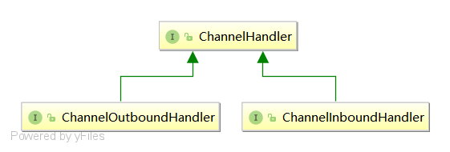

# Netty介绍

Netty是一个NIO客户端服务器框架，可快速轻松地开发网络应用程序，例如协议服务器和客户端。它极大地简化和简化了网络编程，例如TCP和UDP套接字服务器。


功能列表：

- Unified API for various transport types - blocking and non-blocking socket（封装了统一的io模型的api  channel）
- Based on a flexible and extensible event model which allows clear separation of concerns
- Highly customizable thread model - single thread, one or more thread pools such as SEDA（高度灵活的线程模型）
- True connectionless datagram socket support (since 3.1)


## 1. EventLoop 体系


### 1.1 EventLoopGroup

EventLoopGroup，它由EventLoop的组成的，采用轮询的方式选择组中的EventLoop去注册Channel，接口继承图如下：


1. 


## 2. Channel体系


## 3. ChannelHandler体系

当Channel中发生事件时，Netty会将事件交由ChannelHandler处理，ChannelHandler分为两种，一种是入站处理，一种是出站处理。继承关系图如下：



ChannelInboundHandler最典型的就是解码器，Netty默认提供很多协议的入站解码器，例如http，websocket等，当然Netty也提供基础的TCP解码器帮助开发人员定制自己的协议。而与之对应的就是编码器了ChannelOutboundHandler，将数据按照协议的格式进行编码发出。


 ## 4. ChannelHandlerContext体系

ChannelHandlerContext是ChannelHandler的执行上下文，也是ChannelHandler的包装类，向ChannelPipeline 中添加ChannelHandler时需要将ChannelHandler包装成ChannelHandlerContext对象，然后才能添加到Pipeline的链表中去。

```java 
// 实例化HandlerContext对象
private AbstractChannelHandlerContext newContext(EventExecutorGroup group, String name, ChannelHandler handler) {
    return new DefaultChannelHandlerContext(this, childExecutor(group), name, handler);
}
public final ChannelPipeline addLast(EventExecutorGroup group, String name, ChannelHandler handler) {
    final AbstractChannelHandlerContext newCtx;
    synchronized (this) {
        checkMultiplicity(handler);
        // 将handler包装成handlerContext对象
        newCtx = newContext(group, filterName(name, handler), handler);
        addLast0(newCtx);
        // If the registered is false it means that the channel was not registered on an eventloop yet.
        // In this case we add the context to the pipeline and add a task that will call
        // ChannelHandler.handlerAdded(...) once the channel is registered.
        if (!registered) {
            newCtx.setAddPending();
            callHandlerCallbackLater(newCtx, true);
            return this;
        }
        EventExecutor executor = newCtx.executor();
        if (!executor.inEventLoop()) {
            newCtx.setAddPending();
            executor.execute(new Runnable() {
                @Override
                public void run() {
                    callHandlerAdded0(newCtx);
                }
            });
            return this;
        }
    }
    callHandlerAdded0(newCtx);
    return this;
}
```

 ## 5. ChannelPipeline 体系

ChannelPipeline是Netty中处理事件的管道，管理所有的ChannelHandler，在管道的两端，提供对Channel的读写操作的封装。最终数据会交由Channel的Unsafe类处理发出。

## 6. ChannelFuture体系

ChannelFuture

 ## 7.  CodeC体系

