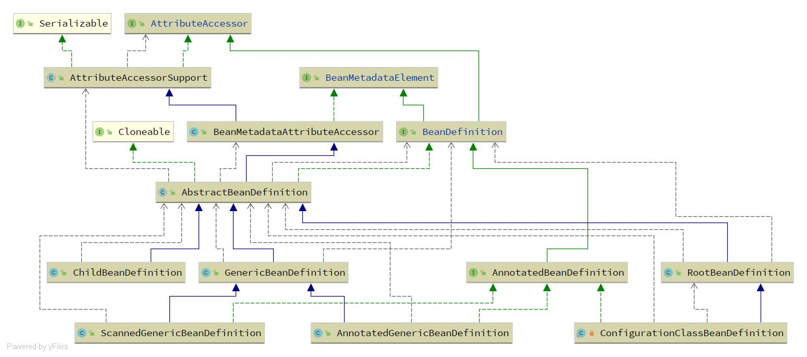

# Spring Bean Definition

## 1. Spring Bean Definition概述

Spring Bean Definition (后文用BD表示)，是用来描述一个Java类的定义，Spring可以根据BD实例化一个真实的Java对象。每一个Java类都会被Spring描述成一个BD的对象。Spring容器会管理这些BD对象这些对象包含如下属性：

1. 包限定的类名
2. Bean的行为配置，例如（scope，lifecycle callbacks等等）
3. 引用其他的Bean
4. 在创建bean时的其他配置元素


bean的定义如下表（引用至[Spring官网](https://docs.spring.io/spring/docs/current/spring-framework-reference/core.html#beans-definition)）

| **Property**             | 解释                               |
| ------------------------ | ---------------------------------- |
| Class                    | Java类                             |
| Name                     | bean的名称                         |
| Scope                    | bean的作用域                       |
| Constructor arguments    | 构造方法参数                       |
| Properties               | 属性（自动注入）                   |
| Autowiring mode          | 自动注入模型                       |
| Lazy initialization mode | 懒加载                             |
| Initialization method    | init方法（life cycle callback）    |
| Destruction method       | destroy方法（life cycle callback） |


## 2. Spring Bean Definition 类继承图




### 2.1 BeanDefinition接口

BeanDefinition接口继承了`AttributeAccessor`和`BeanMetadataElement`

1. AttributeAccessor提供了BD属性的操作的接口，AttributeAccessor的实现类`AttributeAccessorSupport`中有一个属性map

```java
/** Map with String keys and Object values. */
private final Map<String, Object> attributes = new LinkedHashMap<>();
```

这个map为bd提供了扩展属性的功能，开发人员可以手动为bd设置一些特殊属性，这些属性都会存放在这个map中，spring内部也会用到这个map，参考spring的后置处理器（ConfigurationClassPostProcessor）。

2. BeanMetadataElement接口只提供了一个方法，`getSource()`，指定当前BD的来源（一般是一个类字节码）。

BeanDefinition方法如下：

```java
public interface BeanDefinition extends AttributeAccessor, BeanMetadataElement {
	// 设置父bd名称
	void setParentName(String parentName);
	String getParentName();
	//设置bd的beanClassName
	void setBeanClassName(String beanClassName);
	String getBeanClassName();
	//设置bean的作用域，1. 单例 2. 原型 等
	void setScope(String scope);
	String getScope();
	//设置bean是否是懒加载
	void setLazyInit(boolean lazyInit);
	boolean isLazyInit();
	//设置bean的依赖bean
	void setDependsOn(@Nullable String... dependsOn);
	String[] getDependsOn();
	//设置是否作为spring的自动注入的候选bean
	void setAutowireCandidate(boolean autowireCandidate);
	boolean isAutowireCandidate();
	//设置是否为首要候选bean
	void setPrimary(boolean primary);
	boolean isPrimary();
	//设置工厂bean的name
	void setFactoryBeanName(@Nullable String factoryBeanName);
	String getFactoryBeanName();
	//设置bean工厂方法，参考@Bean
	void setFactoryMethodName(@Nullable String factoryMethodName);
	String getFactoryMethodName();
	// bean构造方法参数
	ConstructorArgumentValues getConstructorArgumentValues();
	default boolean hasConstructorArgumentValues() {return !getConstructorArgumentValues().isEmpty();}
	//bean实例使用的property values，用于属性注入
	MutablePropertyValues getPropertyValues();
	default boolean hasPropertyValues() {return !getPropertyValues().isEmpty();}
	// bean的生命周期回调方法
	void setInitMethodName(@Nullable String initMethodName);
	String getInitMethodName();
	void setDestroyMethodName(@Nullable String destroyMethodName);
	String getDestroyMethodName();
	// 角色
	void setRole(int role);
	int getRole();
	// bd的描述（human-readable）
	void setDescription(@Nullable String description);
	String getDescription();
	// Read-only attributes
	// 类型解析器
	ResolvableType getResolvableType();
	// 作用域是不是单例
	boolean isSingleton();
	// 作用域是不是原型
	boolean isPrototype();
	// bd是否是抽象的，如果是抽象的，spring不会实例化
	boolean isAbstract();
	// 资源描述
	String getResourceDescription();
	// 原始的bd
	BeanDefinition getOriginatingBeanDefinition();
}
```

## 3 BeanDefinition子类


### 3.1 AbstractBeanDefinition

AbstractBeanDefinition是BeanDefinition的顶级实现类，其他子类都是这个抽象类的实现。AbstractBeanDefinition中定义了大量的bd的成员变量，

```java
public abstract class AbstractBeanDefinition extends BeanMetadataAttributeAccessor
		implements BeanDefinition, Cloneable {
    
    //bd的class 1. 直接是Class类型， 2. class的全限定命，字符串类型
	private volatile Object beanClass;
	//作用域
	private String scope = SCOPE_DEFAULT;
	//是否是抽象类
	private boolean abstractFlag = false;
	//是否是懒加载
	private Boolean lazyInit;
	//注入模型
	private int autowireMode = AUTOWIRE_NO;
	// 依赖检查
	private int dependencyCheck = DEPENDENCY_CHECK_NONE;
	// 依赖bean
	private String[] dependsOn;
	//是否是自动注入的候选者
	private boolean autowireCandidate = true;
	//是否是自动注入的首选者
	private boolean primary = false;
	// 指定自动注入的候选者
	private final Map<String, AutowireCandidateQualifier> qualifiers = new LinkedHashMap<>();
	// java对象的获取接口
	private Supplier<?> instanceSupplier;
	// whether to allow access to non-public constructors and methods.
	private boolean nonPublicAccessAllowed = true;
	//选取构造方法是否是宽松模式 
	private boolean lenientConstructorResolution = true;
	private String factoryBeanName;
	private String factoryMethodName;
    //构造方法参数值
	private ConstructorArgumentValues constructorArgumentValues;
	private MutablePropertyValues propertyValues;
	private MethodOverrides methodOverrides = new MethodOverrides();
	private String initMethodName;
	private String destroyMethodName;
	private boolean enforceInitMethod = true;
	private boolean enforceDestroyMethod = true;
	private boolean synthetic = false;
	private int role = BeanDefinition.ROLE_APPLICATION;
	private String description;
	private Resource resource;
    
    // ....
}
```


### 3.2  RootBeanDefinition

RootBeanDefinition是AbstractBeanDefinition的子类，只能被用做根bd，不能被设置父bd。

可以设置为抽象的，如果设置成抽象类，spring不会进行实例化，但是可以设置bd的属性，如果有ChildBeanDefinition继承了抽象的RootBeanDefinition，ChildBeanDefinition就可以使用Root中定义的属性，实现一个模板BD的作用。

如果不设置成抽象的，就可以看作成一个普通的bd，spring会按照正常的流程处理。


### 3.3 ChildBeanDefinition

ChildBeanDefinition是AbstractBeanDefinition的子类，只能被用做子bd，实例化时必须提供一个父bd。

### 3.4 GenericBeanDefinition

GenericBeanDefinition是AbstractBeanDefinition的子类，从Spring 2.5开始能替代ChildBeanDefinition的功能，可以设置父bd，也可以不设置。

### 3.5 AnnotatedGenericBeanDefinition

AnnotatedGenericBeanDefinition是GenericBeanDefinition的子类，同时又实现了AnnotatedBeanDefinition。Spring使用注解配置时会将一个配置类变成AnnotatedGenericBeanDefinition，后续Spring解析配置类。

```java
@ComponentScan
public class Main {
	private Logger logger = LoggerFactory.getLogger(Main.class);
	public static void main(String[] args) {
        //保存cglib生成的代理类
		System.setProperty(DebuggingClassWriter.DEBUG_LOCATION_PROPERTY, "Z:\\code2");
		AnnotationConfigApplicationContext applicationContext = new AnnotationConfigApplicationContext();
        // 1. Spring会为Main.class生成一个AnnotatedGenericBeanDefinition，并放在容器中
		applicationContext.register(Main.class);
        // 2. Spring刷新时会解析Main.class对应的bd，并获取注解@ComponentScan，执行扫描。
		applicationContext.refresh();
	}
}
```


### 3.6 ScannedGenericBeanDefinition

ScannedGenericBeanDefinition和AnnotatedGenericBeanDefinition的实现类相同，但是作用不同。Spring在执行扫描的时候会为每一个加了@Component注解的类生成一个ScannedGenericBeanDefinition类型的bd，同样的Spring也会在后续进行解析。

ScannedGenericBeanDefinition和AnnotatedGenericBeanDefinition比较

1. AnnotationMetadata初始化方式

ScannedGenericBeanDefinition中AnnotationMetadata是Spring在扫描类是通过asm读取.class字节码获取的

AnnotatedGenericBeanDefinition中AnnotationMetadata则是Spring通过Java反射进行读取

2. AnnotationMetadata子类类型

ScannedGenericBeanDefinition中AnnotationMetadata的类型为SimpleAnnotationMetadata

AnnotatedGenericBeanDefinition中AnnotationMetadata的类型为StandardAnnotationMetadata

   

### 3.7 ConfigurationClassBeanDefinition

ConfigurationClassBeanDefinition是ConfigurationClassBeanDefinitionReader的一个内部类，继承RootBeanDefinition和实现AnnotatedBeanDefinition，Spring在处理@Bean时会生成一个ConfigurationClassBeanDefinition的bd放入spring的容器中。

ConfigurationClassBeanDefinition中factoryMethodMetadata指定方法上的注解元数据。AnnotatedGenericBeanDefinition也有这个变量，一般不会用到，而ScannedGenericBeanDefinition不存在这个变量。


```
private final MethodMetadata factoryMethodMetadata;
```