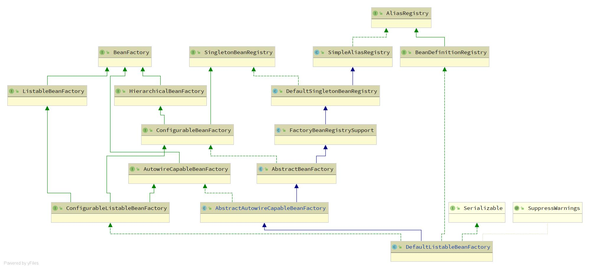

# Spring Bean的生命周期

Bean的生命周期个人理解包括3大块，分别是

1. BeanDefinition的注册
2. Bean的实例化（Instantiation）
3. Bean的初始化（Initialization）


通常所说的生命周期包括Bean实例化和初始化，而BeanDef的注册个人理解也可以归类为Bean的生命周期，因为Spring在创建一个Bean的时候是依据BeanDef的，也就是说没有BeanDef就Spring就不会创建Bean。

在了解Spring Bean生命周期前需要先理解Spring容器的生命周期，这里先简单的介绍下。这里使用的是AnnotationConfigApplicationContext容器对象，使用的Java-based配置的容器。

启动一个Spring容器分为一下几步：

```java
@ComponentScan
public class Main {
    public static void main(String[] args) {
        // 1. 实例化容器
    	AnnotationConfigApplicationContext applicationContext = new AnnotationConfigApplicationContext();
        // 2. 注册一个基础配置类
        applicationContext.register(Main.class);
        // 3. 刷新容器
		applicationContext.refresh();
    }
}
```

> 在基础配置类上@ComponentScan可以启动扫描。

在刷新容器的代码中即包含了Spring Bean的生命周期流程。

```java
public void refresh() throws BeansException, IllegalStateException {
   synchronized (this.startupShutdownMonitor) {
      prepareRefresh();
      ConfigurableListableBeanFactory beanFactory = obtainFreshBeanFactory();
      prepareBeanFactory(beanFactory);
      try {
         postProcessBeanFactory(beanFactory);
		 // 1. 这里是解析和扫描BD，并注册BD的入口
         invokeBeanFactoryPostProcessors(beanFactory);
		 // 2. 这里是注册所有的BeanPostProcessor到容器中，BeanPostProcessor是Bean生命周期中最重要的组件
         registerBeanPostProcessors(beanFactory);
         initMessageSource();
         initApplicationEventMulticaster();
         onRefresh();
         registerListeners();
         //3. 这里开始实例化和初始化所有的(non-lazy-init) singletons Bean
         finishBeanFactoryInitialization(beanFactory);
         finishRefresh();
      } catch (BeansException ex) {
         destroyBeans();
         cancelRefresh(ex);
         throw ex;
      }finally {
         resetCommonCaches();
      }
   }
}
```

下面逐个分析Bean生命周期的三个流程。

## 1. BeanDefinition的注册

BeanDefinition是Spring构建Bean的蓝图，在创建Bean之前需要注册到Spring的容器中，其中注册的方式个人理解有一下几种：

1. Spring原生
2. 手动注册
3. 扫描注册


### 1.1 Spring原生类的BD注册


Spring的AnnotationConfigApplicationContext容器在实例化时，会注册所有的原生的5个BeanDef。注册代码如下：

```java
public AnnotationConfigApplicationContext() {
   this.reader = new AnnotatedBeanDefinitionReader(this);
   this.scanner = new ClassPathBeanDefinitionScanner(this);
}

public AnnotatedBeanDefinitionReader(BeanDefinitionRegistry registry, Environment environment) {
    Assert.notNull(registry, "BeanDefinitionRegistry must not be null");
    Assert.notNull(environment, "Environment must not be null");
    this.registry = registry;
    this.conditionEvaluator = new ConditionEvaluator(registry, environment, null);
    // 注册所有的原生注解的后置处理器
    AnnotationConfigUtils.registerAnnotationConfigProcessors(this.registry);
}
// 注解扫描
RootBeanDefinition def = new RootBeanDefinition(ConfigurationClassPostProcessor.class);
// 属性注入
RootBeanDefinition def = new RootBeanDefinition(AutowiredAnnotationBeanPostProcessor.class);
RootBeanDefinition def = new RootBeanDefinition(CommonAnnotationBeanPostProcessor.class);
// 可选的JPA注解后置处理器
// PersistenceAnnotationBeanPostProcessor
// 事件处理
RootBeanDefinition def = new RootBeanDefinition(EventListenerMethodProcessor.class);
RootBeanDefinition def = new RootBeanDefinition(DefaultEventListenerFactory.class);

```


Spring原生的BeanDef实际上对应了5个Bean，这5个Bean在其他bean生命周期起到了重要作用，首先是ConfigurationClassPostProcessor，这个类实现了Spring的`@ComponentScan`扫描功能、`@Configuration` java-based的配置功能、`@Import` 导入功能等。

AutowiredAnnotationBeanPostProcessor和CommonAnnotationBeanPostProcessor提供了对bean的属性注入功能。


### 1.2  手动BD注册


手动的bd是调用Spring暴漏的API来实现，一般我们用不到。例如:

```java
AnnotationConfigApplicationContext applicationContext = new AnnotationConfigApplicationContext();
applicationContext.register(Main.class);
applicationContext.register(MyBeanDefinitionRegistryPostProcessor.class);

BeanDefinitionBuilder builder = BeanDefinitionBuilder.rootBeanDefinition(Company.class);
applicationContext.registerBeanDefinition("company",builder.getBeanDefinition());
```

Spring在初始化容器时，需要手动注册一个BeanDef，其意义在于要给Spring容器一个基础的配置类，例如：

```java
@ComponentScan
public class Main {
    public static void main(String[] args) {
    	AnnotationConfigApplicationContext applicationContext = new AnnotationConfigApplicationContext();
        applicationContext.register(Main.class);
		applicationContext.refresh();
    }
}
```

上述代码就是给Spring容器中手动注册了一个Main.class，Spring在解析Main.class对应的BD时会读取@ComponentScan，然后基于@ComponentScan配置的包名进行扫描。并将扫描到的Bd注册到Spring容器中。

同样的Spring Boot也是利用这种方式启动容器的，例如：

```java
@SpringBootApplication
public class Application  {
    public static void main(String[] args) {
        SpringApplication.run(Application.class);
    }
}
```

这里的Application.class就是基础配置类，@SpringBootApplication注解中包含@ComponentScan和@EnableAutoConfiguration两个注解，分别对应组件扫描和自动装配。


### 1.3  解析和扫描注册BD

Spring在解析基础配置类上的@ComponentScan注解会进行扫描，而在扫描过程中会找到被@Component注解的类，并将其解析为Bd然后注册到Spring容器中。

执行扫描和解析的的类为ConfigurationClassPostProcessor，其继承关系如下所示：


```java
public interface BeanFactoryPostProcessor {
	void postProcessBeanFactory(ConfigurableListableBeanFactory beanFactory) throws BeansException;
}
public interface BeanDefinitionRegistryPostProcessor extends BeanFactoryPostProcessor {
	void postProcessBeanDefinitionRegistry(BeanDefinitionRegistry registry) throws BeansException;
}

```

当ApplicationContext进行refresh是会调用invokeBeanFactoryPostProcessors方法，在这个方法里会执行所有BeanFactory后置处理器。执行流程如下：

1. 实例化所有的BeanDefinitionRegistryPostProcessor类型的后置处理器
2. 执行BeanDefinitionRegistryPostProcessor后置处理器的postProcessBeanDefinitionRegistry方法。
3. 实例化所有的BeanPostProcessor类型的后置处理器
4. 执行BeanPostProcessor后置处理器的postProcessBeanFactory方法。


ConfigurationClassPostProcessor实现了postProcessBeanDefinitionRegistry方法，在这个方法里，首先会循环当前的容器中的BD，而此时容器中只有Spring原生BD和我们手动注入的Java-Based基础配置类BD。对于原生的BD来说，由于其没有@Component或者@Configuration注解，所以不会执行任何动作。但是对于我们的基础配置类BD，我们添加了@ComponentScan注解，这时ConfigurationClassPostProcessor会根据@ComponentScan包中的报名执行扫描，具体解析注解和执行扫描的逻辑都在ConfigurationClassParser类中进行。具体代码如下：

```java
String[] candidateNames = registry.getBeanDefinitionNames();

for (String beanName : candidateNames) {
   BeanDefinition beanDef = registry.getBeanDefinition(beanName);
    // 判断时候被解析过
   if (beanDef.getAttribute(ConfigurationClassUtils.CONFIGURATION_CLASS_ATTRIBUTE) != null) {}
   else if (ConfigurationClassUtils.checkConfigurationClassCandidate(beanDef, this.metadataReaderFactory)) {
      configCandidates.add(new BeanDefinitionHolder(beanDef, beanName));
   }
}
ConfigurationClassParser parser = new ConfigurationClassParser(
				this.metadataReaderFactory, this.problemReporter, this.environment,
				this.resourceLoader, this.componentScanBeanNameGenerator, registry);
Set<BeanDefinitionHolder> candidates = new LinkedHashSet<>(configCandidates);
do {
    // 解析java-based 基础配置类
    parser.parse(candidates);
    // 执行校验
    parser.validate();
    // 此处省略了向容器中注入bd
    
}
while (!candidates.isEmpty());
```


#### 1.3.1 解析流程

ConfigurationClassParser会循环解析所有的基础配置类BD，并将其封装成ConfigurationClass类，这个类代表了用户定义的一个加了@Configuration的配置类，包含的属性如下：

```java
final class ConfigurationClass {
    //类上的注解信息 
    private final AnnotationMetadata metadata;
	//类所在的资源
    private final Resource resource;
	//Spring容器中beanName
    private String beanName;
	//被那个配置类导入的
    private final Set<ConfigurationClass> importedBy = new LinkedHashSet<>(1);
	//类中加了@Bean的方法
    private final Set<BeanMethod> beanMethods = new LinkedHashSet<>();
	//类上导入的Spring配置，参考@ImportResource
    private final Map<String, Class<? extends BeanDefinitionReader>> importedResources = new LinkedHashMap<>();
	//类上导入的类，参考@Import
    private final Map<ImportBeanDefinitionRegistrar, AnnotationMetadata> importBeanDefinitionRegistrars =
          new LinkedHashMap<>();
	// 跳过的beanMethod，在@Bean的方法上加条件@Conditional
    final Set<String> skippedBeanMethods = new HashSet<>();
}
```


ConfigurationClassParser解析一个ConfigurationClass的流程如下：

1. 根据类上的@Conditional注解，判断是否跳过
2. 获取ConfigurationClass的SourceClass，最终通过asm或者java反射的方式获取类上的注解信息
3. 解析@Component注解，在判断其内部类中是否有ConfigurationCandidate，如果有，先解析内部类。
4. 解析@PropertySource和@PropertySources，向环境中加入配置文件
5. 解析@ComponentScan和@ComponentScans，执行扫描逻辑
6. 解析@Import注解，执行导入逻辑
7. 解析@ImportResource，执行导入Spring xml配置文件逻辑
8. 解析类内部的加了@Bean注解的方法
9. 解析类接口里的@Bean
10. 判断是否有父类，如果有，开始解析父类，直到父类不是jdk下的类或者已经解析过的类


#### 1.3.2 扫描流程

扫描流程是属于解析流程的一部分，是对@ComponentScan的解析和执行过程，而在这个过程中使用到的类为ClassPathBeanDefinitionScanner扫描会依据一个包路径开始，并依据包路径构建一个扫描路径例如`classpath*:cwy/demo/spring/**/*.class`。最后将扫描到的class文件通过ASM框架进行解析。

解析后的得到一个MetadataReader对象，能通过这个对象能获取class元信息。

MetadataReader接口的信息如下：

```java
public interface MetadataReader {
   /**
    * Return the resource reference for the class file.
    */
   Resource getResource();
   /**
    * Read basic class metadata for the underlying class.
    */
   ClassMetadata getClassMetadata();
   /**
    * Read full annotation metadata for the underlying class,
    * including metadata for annotated methods.
    */
   AnnotationMetadata getAnnotationMetadata();
}
```

获取到的MetadataReader对象会调用ClassPathBeanDefinitionScanner类中的isCandidateComponent方法进行过滤，有两重过滤。

1. 使用excludeFilters和includeFilters并配合@Conditional进行第一重过滤
2. 判断类是否是接口或者是包含@Lookup的抽象类

过滤完的MetadataReader会被组装成ScannedGenericBeanDefinition，最后注册到Spring容器中。

> 如果想实现自定义Spring的组件扫描功能，可以继承ClassPathBeanDefinitionScanner类，并重写isCandidateComponent方法提供自定义的过滤条件。Mybatis的MapperScan就是这样实现的。


#### 1.3.3 @Bean注册流程

Spring在解析ConfigurationClass时会解析其中加了@Bean的方法，解析过程如下：

1. 获取所有加了@Bean的方法
2. 封装成BeanMethod对象，并保存在ConfigurationClass中的beanMethods集合中

真正注册@Bean的BD不在解析流程中，在解析结束后会先执行校验流程，校验完成后会循环找到的ConfigurationClass，并逐个加载其中的beanMethods中的BeanMethod对象，最后将BeanMethod对象转换成ConfigurationClassBeanDefinition对象注册到Spring容器中。


#### 1.3.4 @Import注册流程

TBD


## 2. Bean的实例化

 Bean的实例化是用一个class去创建一个Java对象的过程，这个过程在Java中一般使用new关键字来实现，但是这种实现方式是程序员手动去创建并写死在代码中，具有一定的依赖性和耦合性。而如果将这个过程交给Spring来做的话，我们就不需要关心这个对象是怎么实例化的，具体是实现类是那个，我们只需要将注意力放在如何去使用一个对象。将创建，管理对象的权力交给Spring容器，个人理解这种方式就将对象的一部分控制权交给容器来管理，也就是Spring IOC的思想。

Spring在实例化和初始化Bean的过程中使用了大量的BeanPostProcessor，其中Spring原生的BeanPostProcessor在这个过程中起到了重要的作用，可以毫不夸张地说，Spring Bean的生命周期就是各种BeanPostProcessor在不同时期调用不同的方法实现的。

### 2.1 BeanPostProcessor注册

Spring在使用BeanPostProcessor之前需要先从容器中得到所有的BeanPostProcessor，并依据PriorityOrdered，Ordered进行分批注册到Spring容器中。

这里介绍几个核心的Spring后置处理器

1. AutowiredAnnotationBeanPostProcessor

   处理@Autowired和@Value注解的后置处理器，用于推断构造方法，属性注入。

2. CommonAnnotationBeanPostProcessor

   处理@Resource和@PostConstruct，@PreDestroy注解的后置处理器，用于属性注入，执行生命周期回调方法

3. AbstractAutoProxyCreator

   生成aop代理对象，子类AnnotationAwareAspectJAutoProxyCreator使用AspectJ语法构建代理对象。


### 2.2 Bean实例化流程

Spring创建并管理Bean的类被称为Bean工厂，Spring默认的工厂类为DefaultListableBeanFactory，其类继承结构如下：



Spring实例化Bean的流程都在Bean工厂中完成，其主要流程如下：

1.  创建bean的准备工作
2.  推断构建函数
3.  依据构造函数使用反射创建bean
4.  将当前创建对象放到放到二级缓存中，为后续循环依赖做准备


#### 2.2.1  容器的预先实例化

实例化流程是从AbstractBeanFatory的createBean方法开始的，但是这个流程是Spring在调用容器getBean方法时触发的流程，Spring在getBean的逻辑中会判断这个bean是否已经存在了，如果已经存在了，就从单例池中获取并返回（针对singleton的bean）。如果不存在或者不是单例的，那么就会调用createBean方法执行Bean的实例化流程。

首先在Spring容器refresh时，会调用getBean方法预先实例化所有单例bean，在这个过程中就触发了Bean的实例化流程。其主体逻辑在DefaultListableBeanFactory#preInstantiateSingletons的方法中，代码如下：

```java
public void preInstantiateSingletons() throws BeansException {

    	//获取所有的Bean Name
		List<String> beanNames = new ArrayList<>(this.beanDefinitionNames);

		// 触发非懒加载的Bean实例化流程，触发方式就是调用getBean()
		for (String beanName : beanNames) {
			RootBeanDefinition bd = getMergedLocalBeanDefinition(beanName);
			if (!bd.isAbstract() && bd.isSingleton() && !bd.isLazyInit()) {
				if (isFactoryBean(beanName)) {
					Object bean = getBean(FACTORY_BEAN_PREFIX + beanName);
					if (bean instanceof FactoryBean) {
						final FactoryBean<?> factory = (FactoryBean<?>) bean;
						boolean isEagerInit;
						if (System.getSecurityManager() != null && factory instanceof SmartFactoryBean) {
							isEagerInit = AccessController.doPrivileged((PrivilegedAction<Boolean>)
											((SmartFactoryBean<?>) factory)::isEagerInit,
									getAccessControlContext());
						}
						else {
							isEagerInit = (factory instanceof SmartFactoryBean &&
									((SmartFactoryBean<?>) factory).isEagerInit());
						}
						if (isEagerInit) {
							getBean(beanName);
						}
					}
				}
				else {
					getBean(beanName);
				}
			}
		}
		// Trigger post-initialization callback for all applicable beans...
	}
```

getBean方法最终会调用doGetBean方法，在doGetBean方法中会现去Spring的三级缓存中获取Bean，如果三级缓存中获取不到，那么Spring就会执行createBean方法，这里分为三种情况，

1. 如果Bean是单例模式的，Spring实例化完成后加入到三级缓存中，后续就不在创建了。
2. 如果Bean是原型模式的，Spring会为每一个调用者创建一个新的Bean
3. 如果是其他Scope的，Spring将创建Bean的决定权交给Scope对象

在做完上面的流程后，Spring最终实例化一个Bean返回给getBean的调用者。

#### 2.2.2  Bean实例化

在createBean中，Spring首先会解析Bean的class，因为有些BD记录的String类型的ClassName，所以在创建Bean前需要加载ClassName对应的Java类。解析完class类型后，**Spring第一次调用Bean后置处理器**，类型为InstantiationAwareBeanPostProcessor，方法为postProcessBeforeInstantiation，如果返回的Bean不为空，直接返回，这样后续的流程都不会执行，对应的代码为：

```java
try {
   // Give BeanPostProcessors a chance to return a proxy instead of the target bean instance.
   // 第一次调用 Bean后置处理器
   Object bean = resolveBeforeInstantiation(beanName, mbdToUse);
   if (bean != null) {
      return bean;
   }
}
catch (Throwable ex) {
   throw new BeanCreationException(mbdToUse.getResourceDescription(), beanName,
         "BeanPostProcessor before instantiation of bean failed", ex);
}

protected Object resolveBeforeInstantiation(String beanName, RootBeanDefinition mbd) {
    Object bean = null;
    if (!Boolean.FALSE.equals(mbd.beforeInstantiationResolved)) {
        if (!mbd.isSynthetic() && hasInstantiationAwareBeanPostProcessors()) {
            Class<?> targetType = determineTargetType(beanName, mbd);
            if (targetType != null) {
                // 调用Bean实例化前置处理方法
                bean = applyBeanPostProcessorsBeforeInstantiation(targetType, beanName);
                if (bean != null) {
                    // 如果返回的结果不为空，调用Bean后置处理器的 实例化后处理方法
                    bean = applyBeanPostProcessorsAfterInitialization(bean, beanName);
                }
            }
        }
        mbd.beforeInstantiationResolved = (bean != null);
    }
    return bean;
}
```

这里Spring提供了一个扩展点，在实例化Bean之前，允许后置处理器返回一个代理对象，Spring在这个地方提供了一个原生的后置处理器**AbstractAutoProxyCreator**，用于判断该对象是否需要进行AOP代理逻辑，如果需要则缓存其BeanName，并在后续的流程中为其创建代理对象。

如果第一次调用Bean后置处理器没有返回对象，Spring会调用doCreateBean方法正式创建一个Bean对象。doCreateBean方法就是Spring创建Bean的核心方法，包含bean的实例化和初始化两大流程。首先doCreateBean调用createBeanInstance方法进行Bean的实例化，接着将创建好的Bean实例放到Spring二级缓存中，为循环依赖提供支持，最后调用populateBean和initializeBean方法完成属性注入和Bean初始化。

Bean的实例化有如下3中方式：

1. jdk的Supplier接口，需要在Bd中提供Supplier对象
2. factoryMethod，针对@Bean方式提供的Bean实例化流程
3. constructor，如果没有上述两种方式，那么就会使用构造器来实例化对象。

代码如下：

```java
protected BeanWrapper createBeanInstance(String beanName, RootBeanDefinition mbd, @Nullable Object[] args) {
   // Make sure bean class is actually resolved at this point.
   Class<?> beanClass = resolveBeanClass(mbd, beanName);
   if (beanClass != null && !Modifier.isPublic(beanClass.getModifiers()) && !mbd.isNonPublicAccessAllowed()) {
      throw new BeanCreationException(mbd.getResourceDescription(), beanName,
            "Bean class isn't public, and non-public access not allowed: " + beanClass.getName());
   }
   // 1. 从Supplier函数中获取。
   Supplier<?> instanceSupplier = mbd.getInstanceSupplier();
   if (instanceSupplier != null) {
      return obtainFromSupplier(instanceSupplier, beanName);
   }
   // 2. 从getFactoryMethod中获取
   if (mbd.getFactoryMethodName() != null) {
      return instantiateUsingFactoryMethod(beanName, mbd, args);
   }
   // Shortcut when re-creating the same bean...
   boolean resolved = false;
   boolean autowireNecessary = false;
   if (args == null) {
      synchronized (mbd.constructorArgumentLock) {
         if (mbd.resolvedConstructorOrFactoryMethod != null) {
            resolved = true;
            autowireNecessary = mbd.constructorArgumentsResolved;
         }
      }
   }
   if (resolved) {
      if (autowireNecessary) {
         return autowireConstructor(beanName, mbd, null, null);
      }
      else {
         return instantiateBean(beanName, mbd);
      }
   }
   // Candidate constructors for autowiring?
   // 推断构造函数
   // 1. 只有一个并且有参，返回值不为空
   // 2. 有Autowire的
   //    2.1 只有一个Autowire = true
   //    2.2 有多个Autowire = false
   Constructor<?>[] ctors = determineConstructorsFromBeanPostProcessors(beanClass, beanName);

   // 能够进行构造函数装配的条件如下
   // 1. 推断构造函数不为空
   // 2. 注入模型为AUTOWIRE_CONSTRUCTOR
   // 3. beanDef有构造参数的
   // 4. 传入的参数不为空的
   if (ctors != null || mbd.getResolvedAutowireMode() == AUTOWIRE_CONSTRUCTOR ||
         mbd.hasConstructorArgumentValues() || !ObjectUtils.isEmpty(args)) {
      // 执行构造函数装配
      return autowireConstructor(beanName, mbd, ctors, args);
   }
   // Preferred constructors for default construction?
   ctors = mbd.getPreferredConstructors();
   if (ctors != null) {
      return autowireConstructor(beanName, mbd, ctors, null);
   }

   // 使用默认构造函数，一般不写构造函数的类会使用下面的函数实例化
   // No special handling: simply use no-arg constructor.
   return instantiateBean(beanName, mbd);
}
```

这里我们只关注通过构造器实例化对象的方式，Spring在使用构造器实例化对象前，需要先推断构造方法，推断构造方法Spring也是采用调用后置处理器的方式进行，这里是**Spring第二次调用后置处理器**，类型为：SmartInstantiationAwareBeanPostProcessor，调用的方法为determineCandidateConstructors。在这里Spring提供了原生的后置处理器来支持构造方法推断，其类型为AutowiredAnnotationBeanPostProcessor。在这个后置处理器中能返回的构造函数的类必须满足如下条件：

1. 构造函数上没有加@Autowire，并且只有一个有参的构造函数，则返回该构造函数

   ```java
   @Component
   public class SerA {
   	public SerA(SerB serB) {
   	}
   }
   ```

2. 构造函数上加@Autowire，如果required=true，则返回一个，如果required=false，则都返回

   ```java
   @Component
   public class SerA {
      @Autowired(required = false)
      public SerA(SerB serB) {}
      @Autowired(required = false)
      public SerA(SerC serC) {}
   }
   ```

推断完构造函数后，接下来就是利用构造函数去实例化对象了，Spring通过构造函数实例化对象过程相当复杂，Spring将流程都封装到ConstructorResolver类中，ConstructorResolver类集成了构造器和工厂方法两种实例化对象的方式分别对应方法autowireConstructor和instantiateUsingFactoryMethod，这里我们主要关注autowireConstructor方法即通过构造器实例化对象的方式。

autowireConstructor方法的流程比较复杂这里只做简单的介绍，其主体流程如下：

1. 先获取BD中缓存的构造器，如果没有执行下一步
2. 优先使用determineCandidateConstructors推断出来的构造方法，如果推断的构造方法为空，那么将Class中所有的构造方法做为候选构造方法
3. 判读候选构造方法中是不是只有一个默认空实现的构造器，如果有是直接执行实例化，并返回。
4. 循环所有候选构造方法，并找到其中最优的构造方法
5. 找最优构造方法有两个标准 1. 方法参数多则优，2. 方法参数类型和提供的参数值之间差异小则优

这里需要注意的是Spring在选用构造方法参数时，优先选用外部传入的，接着是BD中定义的，最后从容器中取。

Spring最后会构造方法和对应的参数实例化对象，到此Spring完成了Bean的实例化创建了一个Java对象，可以看出java的一个new关键字完成的功能被Spring通过容器进行托管，解放了开发人员对Java对象的创建控制，将其交给了Spring完成，并在后续的初始化中为该对象注入属性，执行aop代理等高级功能。


## 3. Bean的初始化

在上一节中介绍了Spring如何将一个class（BD）实例化成一个Java对象的，不过此时的对象跟用new关键字创建的对象一样，还不是一个Spring Bean，只有执行完Bean的初始化流程后，才能成为Spring Bean。

Bean的初始化流程如下：

1. 属性注入
2.  生命周期回调
3. AOP代理

这3个流程都是在实例化的基础上的，也就是此时我们已经有一个Java对象，我们需要给这个对象执行上面3个流程。即为该对象注入属性，执行该对象的生命周期回调，最后为该对象做aop代理。

在初始化Bean之前会做Spring会做两件事情，1. 第3次调用后置处理器，后置处理器类型为MergedBeanDefinitionPostProcessor，方法为postProcessMergedBeanDefinition，这里主要完成对Class中需要处理的注解进行解析，例如@Resource，@Autowired，@Value，@PostConstruct等。2.  将当前的Java对象放入二级缓存中，为后续的循环引用做准备。

由此在AbstractAutowireCapableBeanFactory#doCreateBean方法中，先是完成Bean的实例化，接着将创建的对象放入二级缓存，最后调用populateBean和initializeBean，完成Bean的实例化，对应的代码如下：

```java
try {
   // 属性注入
   populateBean(beanName, mbd, instanceWrapper);
   // 初始化bean
   exposedObject = initializeBean(beanName, exposedObject, mbd);
}
catch (Throwable ex) {
   if (ex instanceof BeanCreationException && beanName.equals(((BeanCreationException) ex).getBeanName())) {
      throw (BeanCreationException) ex;
   }
   else {
      throw new BeanCreationException(
            mbd.getResourceDescription(), beanName, "Initialization of bean failed", ex);
   }
}
```


#### 3.1 属性注入

我理解的属性注入有两种方式，自动注入和手动注入，自动注入又分为两种模式，byType和byName，手动注入利用注解@Resource，@Autowired，@Value来实现。自动注入在xml版本中可以通过在beans里添加default-autowire指定自动注入模型，如下所示：

```xml
<beans xmlns="http://www.springframework.org/schema/beans"
   xmlns:xsi="http://www.w3.org/2001/XMLSchema-instance" 
   xsi:schemaLocation="
   http://www.springframework.org/schema/beans 
   http://www.springframework.org/schema/beans/spring-beans.xsd" default-autowire="byName">
   <bean class="cwy.demo.spring.base.SimpleBean">
       <property name="num" value="10"/>
   </bean>
</beans>
```

手动注入就比较简单了，直接在想要注入的字段上加上注解即可，需要注意的是@Autowired，@Value是Spring提供的，而@Resource是jdk中的规范。

```java
@Component
public class SerA {

   @Autowired
   private SerB serB;

}
```


Spring在populateBean方法中会完成上述注入方式，在开始属性注入前，Spring会第4次调用后置处理器，类型为InstantiationAwareBeanPostProcessor，方法为postProcessAfterInstantiation，如果返回false，那么Spring会跳过该Bean的属性注入流程，这里提供一个扩展点，如果不想给Bean注入属性，那么可以实现postProcessAfterInstantiation方法，并返回false，就可以跳过属性注入。

```java
// 第4次调用后置处理器，用于是否执行属性注入
if (!mbd.isSynthetic() && hasInstantiationAwareBeanPostProcessors()) {
   for (InstantiationAwareBeanPostProcessor bp : getBeanPostProcessorCache().instantiationAware) {
      // 判断是否要继续完成属性注入
      if (!bp.postProcessAfterInstantiation(bw.getWrappedInstance(), beanName)) {
         return;
      }
   }
}
```

接下来Spring开始执行属性注入流程，首先获取BD中提供的PropertyValues，之后再通过自动注入模型获取Bean依赖的属性，将其与BD提供的属性合并，接着处理手动注入，Spring这里第5次调用后置处理器，类型为InstantiationAwareBeanPostProcessor，方法为postProcessProperties和postProcessPropertyValues，其中postProcessPropertyValues方法在5.1版本后就废弃了，Spring提供了两个实现类AutowiredAnnotationBeanPostProcessor和CommonAnnotationBeanPostProcessor，分别处理@Autowired，@Value和@Resource注解。

```java
// 属性填充
// 1. 获取bd中提供的属性
PropertyValues pvs = (mbd.hasPropertyValues() ? mbd.getPropertyValues() : null);
// 2. 判断Bean的注入模型是否byName还是byType的
int resolvedAutowireMode = mbd.getResolvedAutowireMode();
if (resolvedAutowireMode == AUTOWIRE_BY_NAME || resolvedAutowireMode == AUTOWIRE_BY_TYPE) {
   MutablePropertyValues newPvs = new MutablePropertyValues(pvs);
   // Add property values based on autowire by name if applicable.
   if (resolvedAutowireMode == AUTOWIRE_BY_NAME) {
      autowireByName(beanName, mbd, bw, newPvs);
   }
   // Add property values based on autowire by type if applicable.
   if (resolvedAutowireMode == AUTOWIRE_BY_TYPE) {
      autowireByType(beanName, mbd, bw, newPvs);
   }
   pvs = newPvs;
}

boolean hasInstAwareBpps = hasInstantiationAwareBeanPostProcessors();
boolean needsDepCheck = (mbd.getDependencyCheck() != AbstractBeanDefinition.DEPENDENCY_CHECK_NONE);

PropertyDescriptor[] filteredPds = null;
if (hasInstAwareBpps) {
   if (pvs == null) {
      pvs = mbd.getPropertyValues();
   }
   for (InstantiationAwareBeanPostProcessor bp : getBeanPostProcessorCache().instantiationAware) {
      // 第4次调用后置处理器，完成属性注入
      // 这里完成注入的属性是加了@Autowired，@Value，@Resource等
      PropertyValues pvsToUse = bp.postProcessProperties(pvs, bw.getWrappedInstance(), beanName);
      if (pvsToUse == null) {
         if (filteredPds == null) {
            filteredPds = filterPropertyDescriptorsForDependencyCheck(bw, mbd.allowCaching);
         }
         pvsToUse = bp.postProcessPropertyValues(pvs, filteredPds, bw.getWrappedInstance(), beanName);
         if (pvsToUse == null) {
            return;
         }
      }
      pvs = pvsToUse;
   }
}
```

调用后置处理器的注入会在后置处理器中注入到对象，而自动注入和BD中提供的属性则在后置处理器调用完后的applyPropertyValues方法中完成注入

```java
//这里完成PropertyValues的属性值注入
if (pvs != null) {
   applyPropertyValues(beanName, mbd, bw, pvs);
}
```

自此Spring就完成了Bean的属性注入，这其中还有很多的细节，暂时就不展开了。


#### 3.2 生命周期回调

Spring为Bean提供了3中方式实现生命周期回调分别为 1. @PostConstruct注解形式 2. 实现InitializingBean接口形式的，3 设置了initMethod的（xml中指定）

代码位于initializeBean方法中，如下所示

```java
protected Object initializeBean(String beanName, Object bean, @Nullable RootBeanDefinition mbd) {
    if (System.getSecurityManager() != null) {
        AccessController.doPrivileged((PrivilegedAction<Object>) () -> {
            invokeAwareMethods(beanName, bean);
            return null;
        }, getAccessControlContext());
    }
    else {
        // 调用各种Aware接口
        invokeAwareMethods(beanName, bean);
    }

    Object wrappedBean = bean;
    if (mbd == null || !mbd.isSynthetic()) {
        // 生命周期回调 1. 注解形式的
        wrappedBean = applyBeanPostProcessorsBeforeInitialization(wrappedBean, beanName);
    }

    try {
        // 生命周期回调 2.继承形式的 3. 设置initMethod方式
        invokeInitMethods(beanName, wrappedBean, mbd);
    }
    catch (Throwable ex) {
        throw new BeanCreationException(
            (mbd != null ? mbd.getResourceDescription() : null),
            beanName, "Invocation of init method failed", ex);
    }
    if (mbd == null || !mbd.isSynthetic()) {
        // 完成 aop 代理
        wrappedBean = applyBeanPostProcessorsAfterInitialization(wrappedBean, beanName);
    }

    return wrappedBean;
}
```

注解形式的生命周期回调是Spring第6次调用后置处理器，类型为BeanPostProcessor，方法为postProcessBeforeInitialization。


#### 3.3 AOP代理

aop代理是Spring第7次调用后置处理器，也是最后一次，类型为BeanPostProcessor，方法为postProcessAfterInitialization，这里Spring没有提供默认的后置处理器，但是Spring提供了基于aspectj的aop代理功能，只需要在配置类上加上@EnableAspectJAutoProxy，并将aspectj的包引入项目中，最后配置一个@Aspect注解的切面类即可。

```java
@Component
@Aspect
@EnableAspectJAutoProxy
public class MyAspect {

   @Pointcut("execution(* cwy.demo.spring.base.*.*(..))")
   public void pointCut(){};

   @Before("pointCut()")
   public void doAccessCheck() {
      System.out.println("-------------------------------------------");
      System.out.println("this is aop ");
   }
}
```

这里也不展开说了，后续可以在出一个专门介绍Spring代理的文章。


## 4. 总结

Spring的Bean的生命周期中贯穿了大量的Bean工厂和Bean的后置处理器，由Spring提供默认的实现类完成基础功能，并提供扩展点方便二次开发，扩展更多高级功能。