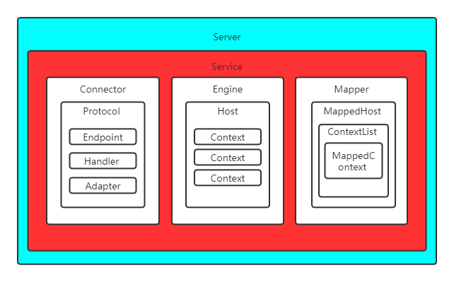

# Tomcat 8.5


## 1. tomcat 主要组件

Server.xml中描述的也是Tomcat 中组件的层次结构。其层次结构如下：



### Server

Server是tomcat最顶层的对象，对应xml文件中的根节点，其内容如下

```xml
<Server port="8005" shutdown="SHUTDOWN">
    <Listener className="XXX" /> <!-- 生命周期监听器 -->
    <GlobalNamingResources></GlobalNamingResources> <!-- Global JNDI resources -->
    <Service name="XXX">
    </Service>
    <!-- 省略 -->
</Server>
```

属性port，接受停止指令的端口；shutdown，停止指令的内容。Server的下的子节点为Service，一个Server可以配置多个Service。

### Service

Service是一个或多个Connector和一个Engine组成的，并且这些Connector共享单个Engine容器处理请求。属性如下：

1. Connector 多个
2. Engine 唯一
3. Mapper，映射器，将Request请求映射到具体的Host,Context,Wrapper。

Service对应的xml中的片段如下：

```xml
<Service name="Catalina">
    <Executor name="tomcatThreadPool" namePrefix="catalina-exec-"
        maxThreads="150" minSpareThreads="4"/>
    <Connector port="8080" protocol="HTTP/1.1"
               connectionTimeout="20000"
               redirectPort="8443" />
    <Engine name="Catalina" defaultHost="localhost"></Engine>
</Service>
```

其中Executor节点配置的线程池是提供给Connector共享的，这个是tomcat调优的一个点，可以配置tomcat最大线程等。

### Connector

Connector是底层网络连接器，用于接受和处理网络连接，并把网络请求的数据封装起来交给Engine容器处理。

Connector包含协议Protocol，默认使用Http11NioProtocol


Protocol中有

1. Endpoint（默认为NioEndpoint）用于接收socket连接。
2. ConnectionHandler 用于处理socket的数据。
3. Adapter 默认为CoyoteAdapter，用与处理http请求。

NioEndpoint有三大组件

1. Acceptor，轮询socket连接请求
2. Poller，轮询socket读写请求
3. SocketProcessor，在线程池中异步处理socket数据

ConnectionHandler中调用Protocol的createProcessor生成协议处理器，并维护Processor（默认为Http11Processor）。

Http11Processor创建Request，Response，并读取Socket数据填充至Request，调用Adapter处理

1. Adapter 
2. Request
3. Response

CoyoteAdapter解析Request，调用Mapper执行**请求映射** ，并调用Engine的管道处理请求。

### Engine


### Mapper


## tomcat 容器

tomcat4大容器为 Engine，Host，Context，Wrapper（Servlet）


## tomcat IO模型


| 模型 | 描述                                                         |
| :--- | ------------------------------------------------------------ |
| BIO  | 阻塞式IO，采用传统的java IO进行操作，该模式下每个请求都会创建一个线程，适用于并发量小的场景 |
| NIO  | 同步非阻塞，比传统BIO能更好的支持大并发，tomcat 8.0 后默认采用该模式（Http11NioProtocol） |
| APR  | tomcat 以JNI形式调用http服务器的核心动态链接库来处理文件读取或网络传输操作，需要编译安装APR库 |
| AIO  | 异步非阻塞，tomcat8.0后支持（Http11Nio2Protocol）            |


