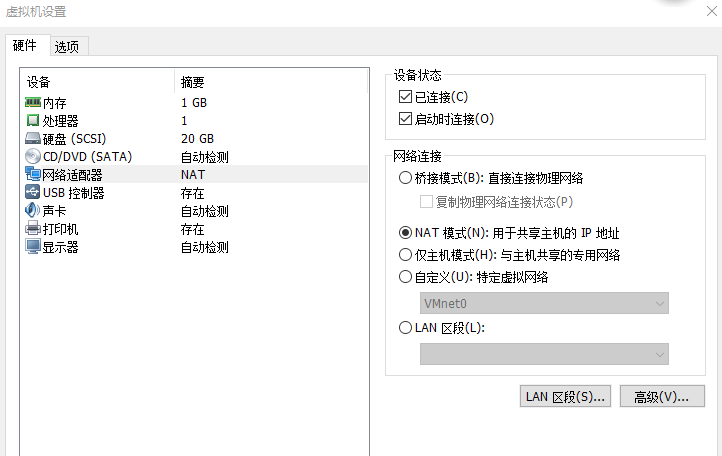
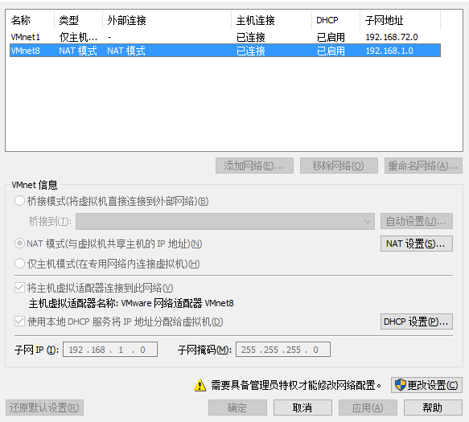
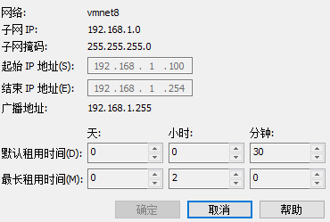

### 系统版本：

	ubuntu server 16.04

### 修改root用户密码

	sudo passwd
然后输入当前用户的密码

### 网络配置

#### VMware网络配置

1.虚拟机统一使用NAT模式

2.修改VMware NAT的子网地址为`192.168.1.0`

3.配置`DHCP`分配`100-254`的ip

#### linux网络配置

1. 打开网络配置文件

		vim /etc/network/interfaces

2. 修改内容如下，网关要根据VMware网络配置来写，不然访问不到网络。

		iface ens33 inet static #设置静态ip
		address 192.168.1.101
		gateway 192.168.1.2
		netmask 255.255.255.0
		dns-nameservers 8.8.8.8 114.114.114.114 #dns服务器
3. 重启linux

#### sshroot登录配置

安装ssh server

	sudo  apt-get install openssh-server

启动ssh-server
	
	service ssh start

修改`etc/ssh/sshd_config` 

	PermitRootLogin yes #改为yes，允许root用户登录

#### java环境变量配置

编辑 `/etc/profile` 添加内容

	export JAVA_HOME=/usr/local/java/jdk1.8.0_161
	export JRE_HOME=${JAVA_HOME}/jre
	export CLASSPATH=.:${JAVA_HOME}/lib:${JRE_HOME}/lib
	export M2_HOME=/usr/local/maven/apache-maven-3.5.2
	export PATH=${JAVA_HOME}/bin:$PATH
	export PATH=$PATH:${M2_HOME}/bin

使配置文件生效

	source /etc/profile

#### ubuntu防火墙

1.关闭ubuntu的防火墙

	ufw disable

1.开启ubuntu的防火墙

	ufw enable
#### 修改时区

编辑/etc/profile添加内容

	TZ='Asia/Shanghai';
	export TZ

使配置文件生效

	source /etc/profile

#### tomcat自启动

	cp jenkins-tomcat/bin/catalina.sh /etc/init.d/
	
	mv /etc/init.d/catalina.sh /etc/init.d/jenkins-tomcat
	
	vim /etc/init.d/jenkins-tomcat
	
	export JENKINS_HOME="/usr/local/jenkins"
	export CATALINA_HOME="/usr/local/tomcat/jenkins-tomcat"
	export JAVA_HOME="/usr/local/java/jdk1.8.0_161"
	
	JAVA_OPTS='-Xms256m -Xmx512m'
	
	systemctl enable jenkins-tomcat
	
	systemctl start jenkins-tomcat

