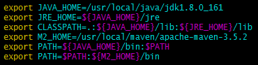

### maven私服搭建

#### 1.准备

maven私服需要使用java环境，首先确保java环境是否存在。

需要用到的资源包

- nexus-3.12.1-01-unix.tar.gz
- apache-maven-3.5.2-bin.zip

可以在nexus的官方网站上下载[nexus-3.12.1-01-unix.tar.gz](https://www.sonatype.com/nexus-repository-oss)，apache-maven-3.5.2-bin.zip可以在[maven官网](http://maven.apache.org/download.cgi)上下载。

#### 2.释放资源包

在`/usr/local`路径下分别建立nexus和maven文件夹

	mkdir -p /usr/local/nexus /usr/local/maven

解压资源到对应的目录

	unzip apache-maven-3.5.2-bin.zip -d /usr/local/maven/
	tar -zxvf nexus-3.12.1-01-unix.tar.gz -C /usr/local/nexus/

#### 3.配置maven

添加`M2_HOME`环境变量，把maven命令添加到PATH中。

	vim /etc/profile
	export M2_HOME=/usr/local/maven/apache-maven-3.5.2
	export PATH=$PATH:${M2_HOME}/bin

进入maven的根目录下的`conf`目录，修改settings.xml文件中本地仓库地址。

	<localRepository>/usr/local/maven/repository</localRepository>

添加阿里云镜像

    <mirror>
        <id>nexus-aliyun</id>
        <mirrorOf>*</mirrorOf> <!--映射所有的请求 -->
        <name>Nexus aliyun</name>
        <url>http://maven.aliyun.com/nexus/content/groups/public</url>
    </mirror>

#### 4.配置nexus

nexus解压后包含两个目录

- nexus -----  存放nexus配置和运行命令等
- sonatype-work -----  存放nexus所有仓库和日志文件等

在`nexus/etc/nexus-default.properties`配置文件中可更改port、host、nexus-work、runtime等，可以直接使用默认配置。

在`nexus/bin/`中使用如下命令启动nexus

	./nexus start
查看运行日志

	tail -f -n 200 sonatype-work/nexus3/log/nexus.log

#### 5.nexus开机自启

编辑nexus/bin/nexus命令，添加如下内容。

	RUN_AS_USER=root
	INSTALL4J_JAVA_HOME="/usr/local/java/jdk1.8.0_161/"

建立软连接

	ln -s /usr/local/nexus/nexus/bin/nexus /etc/init.d/nexus

设置开机自启动

	systemctl enable nexus

#### 6.nexus使用

**本地maven的settings文件配置**

在mirrors节点下添加

	<!-- 私有jar包从nexus上下载 -->
	<mirror>
		<id>nexus</id>
		<mirrorOf>maven-public</mirrorOf><!-- 对应profile中的repository -->
		<url>http://47.105.100.166:8081/repository/maven-public/</url>
    </mirror>

在profiles节点下添加

	<profile>
	
	  <id>nexus</id>
	  <activation>
		<activeByDefault>true</activeByDefault>
		<jdk>1.8</jdk>
	  </activation>
	  <properties>   
		<maven.compiler.source>1.8</maven.compiler.source>
		<maven.compiler.target>1.8</maven.compiler.target>
	    <maven.compiler.compilerVersion>1.8</maven.compiler.compilerVersion>
	  </properties>
      <repositories>
		<!-- 私有库地址-->
        <repository>
          <id>maven-public</id>
          <url>http://47.105.100.166:8081/repository/maven-public/</url>
          <releases>
            <enabled>true</enabled>
          </releases>
          <snapshots>
            <enabled>true</enabled>
            <updatePolicy>always</updatePolicy>
          </snapshots>
        </repository>
      </repositories>
	  
	  
	  <pluginRepositories>
		<!--插件库地址-->
		<pluginRepository>
			<id>maven-public</id>
			<url>http://47.105.100.166:8081/repository/maven-public/</url>
			<releases>
				<enabled>true</enabled>
			</releases>
			<snapshots>
				<enabled>true</enabled>
		   </snapshots>
		</pluginRepository>
	  </pluginRepositories>	
    </profile>

激活profile配置

	<activeProfiles>
	    <activeProfile>nexus</activeProfile>
	  </activeProfiles>

在servers节点下添加

	<!-- 配置Maven服务器的账号信息，自动化部署的时候需要用到 -->
	<server>
	  <id>maven-releases</id>
	  <!-- 使用公共的developer/password账号进行日常的发布管理 -->
	  <username>javadev</username>
	  <password>123456</password>
	</server>

	<server>
	  <id>maven-snapshots</id>
	  <username>javadev</username>
	  <password>123456</password>
	</server>

**maven项目配置**

在pom文件中添加

	<!-- 项目发布配置 -->
	<distributionManagement>
		<repository>
			<!-- 与settings文件中server的ID相同-->
			<id>maven-releases</id>
			<name>Nexus Release Repository</name>
			<url>http://192.168.5.101:8081/repository/maven-releases/</url>
		</repository>
		<snapshotRepository>
			<id>maven-snapshots</id>
			<name>Nexus Snapshot Repository</name>
			<url>http://192.168.5.101:8081/repository/maven-snapshots/</url>
		</snapshotRepository>
	</distributionManagement>