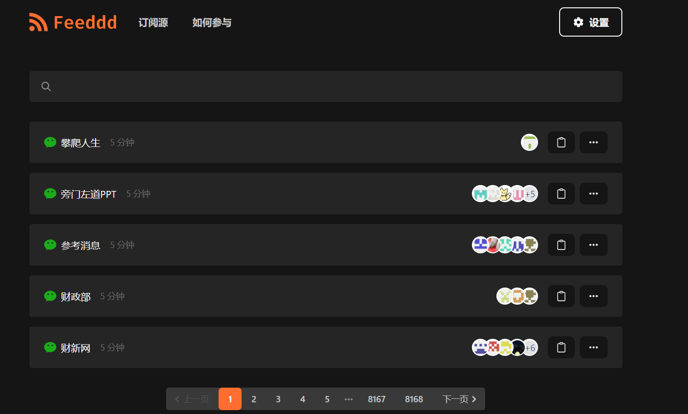
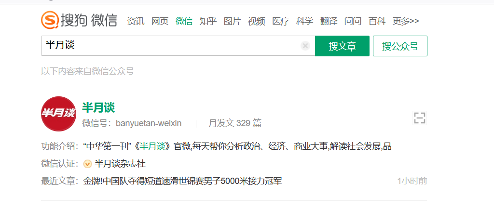

## 1.公众号获取源

https://feeddd.org/feeds/

此网站提供了4万左右的公众号，并且提供了RSS源。

## 2. 搜狗微信爬取数据

有公众号名称后，可以在微信搜狗上爬取公众号数据

https://weixin.sogou.com/

能获取的数据：

1. 微信公众号简介，微信号，微信主题
2. 最新的文章

## 3. 上传数据到数据中心

需要准备一个微信公众号数据管理中心，存储公众号历史文章。

## 4. 公众号分类标注和文章更新

1. 先人工标注公众号的类别，如果可以需要跑数据分析洗数据。

2. 对接资源网站，定时更新和推送数据展示。